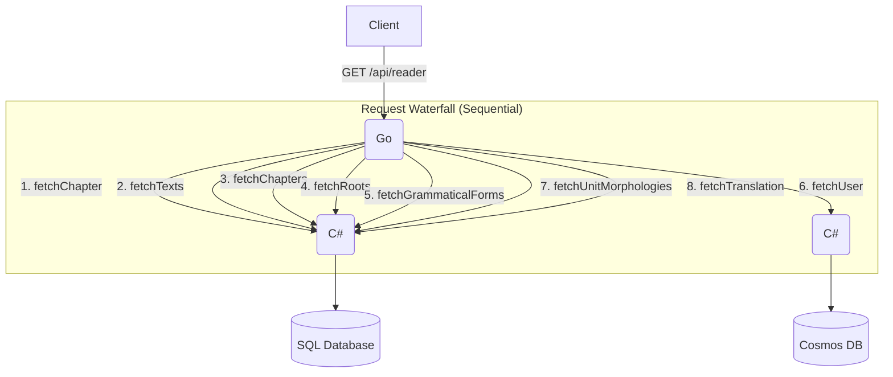
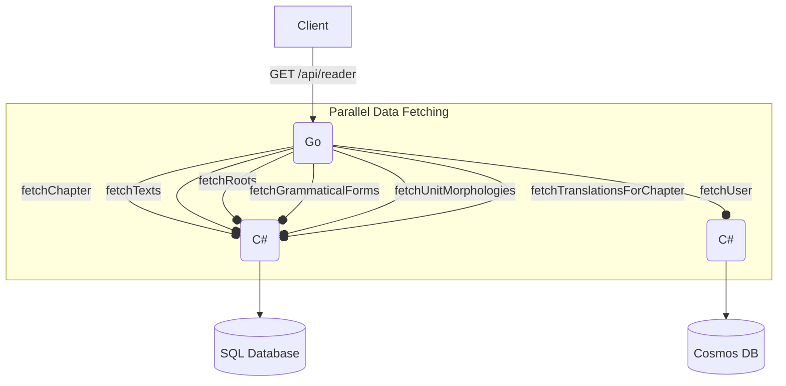

## Design Document: GreekLearningApp-ReaderService Optimization

### 1. Summary Statement

The `GreekLearningApp-ReaderService` is currently experiencing significant performance latency, primarily due to its design as a "stitching" service that makes numerous sequential, blocking HTTP requests to downstream services (`TextService`, `UserService`). This architectural pattern is highly susceptible to compounding delays from network latency and service cold starts. The most critical bottleneck is an N+1 query pattern where individual word translations are fetched one by one inside a loop.

This document proposes a two-phase refactoring project. **Phase 1** will introduce immediate, high-impact performance gains by parallelizing independent API calls and eliminating the N+1 translation query with a new batch endpoint. **Phase 2** proposes a more profound architectural shift to a Backend-for-Frontend (BFF) pattern, consolidating data aggregation logic into the `TextService` for superior long-term performance and maintainability.

### 2. Service Architecture Diagrams

#### Current Architecture

The current architecture creates a request waterfall, where latency is additive.



#### Proposed Phase 1 Architecture

Phase 1 introduces concurrency and batching to reduce the total request time to that of the slowest operation.



#### Proposed Phase 2 Architecture

Phase 2 simplifies the `ReaderService` by delegating data aggregation to a dedicated BFF endpoint in the `TextService`.

```mermaid
graph TD
    Client -->|GET /api/reader| ReaderService(Go);

    subgraph "Simplified Requests"
        ReaderService -->|1. GET /pagedata/{chapterId}| TextService(C#);
        ReaderService -->|2. GET /users/{userId}| UserService(C#);
    end

    subgraph "TextService (BFF Endpoint)"
        TextService -->|Aggregates all text data| SQLDatabase[(SQL Database)];
    end

    UserService --> CosmosDB[(Cosmos DB)];
```

### 3. Rationale for Architectural Decisions

The proposed changes are guided by the following principles:

*   **Performance:** The primary goal is to reduce end-to-end latency.
    *   **Parallelism (Phase 1):** Switching from sequential to concurrent requests fundamentally changes the latency model from `T_total = T1 + T2 + ... + Tn` to `T_total = Max(T1, T2, ..., Tn)`. This provides a dramatic and immediate performance boost.
    *   **Batching (Phase 1):** The N+1 query for translations is the most severe bottleneck. Replacing hundreds of small, high-latency HTTP calls with a single batch request will drastically reduce overhead from network round-trips and request processing.
    *   **Data Locality (Phase 2):** Moving the data aggregation logic into the `TextService` (the service that owns the data) is significantly more efficient. The `TextService` can retrieve all necessary information from the SQL database in a single, highly optimized query or stored procedure, eliminating inter-service network latency for data stitching.

*   **Resilience & Scalability:**
    *   Fewer network calls mean fewer potential points of failure. The Phase 2 architecture reduces the `ReaderService`'s dependencies from ~8 endpoints to just 2, making it more robust.
    *   Reducing the chattiness between services decreases the overall load on the network and the API gateway, allowing the system to scale more effectively.

*   **Maintainability:**
    *   **Separation of Concerns (Phase 2):** The `ReaderService` becomes a pure, lightweight BFF concerned only with calling its data sources and rendering a final view model. The `TextService` becomes the single source of truth for complex text-data queries. This clear separation makes both services easier to understand, debug, and evolve.

### 4. Critical Patterns & Implementation Guide

#### Phase 1: Parallelism and Batching

**1. Parallel Fetching in `handler.go`**

Use a `sync.WaitGroup` to manage concurrent fetch operations. Use a struct to hold the results and an error channel to handle failures.

```go
// In handler.go

// 1. Define a struct to hold fetched data
type PageDataResources struct {
	chapter           Chapter
	texts             []Text
	chapters          []Chapter
	roots             []Root
	grammaticalForms  []GrammaticalForm
	unitMorphologies  []UnitMorphology
	translations      []UnitTranslation // For the new batch endpoint
	user              User
	err               error // To capture the first error
}

// 2. Modify handlePageRequest
func handlePageRequest(rw http.ResponseWriter, req *http.Request) {
	// ... (request decoding) ...

	var wg sync.WaitGroup
	resources := &PageDataResources{}
	errChan := make(chan error, 7) // Buffer for all potential goroutines

	// --- Start Concurrent Fetches ---
	wg.Add(1)
	go func() {
		defer wg.Done()
		var err error
		resources.chapter, err = fetchChapter(prq.ChapterId)
		if err != nil {
			errChan <- fmt.Errorf("failed to fetch chapter: %w", err)
		}
	}()

	wg.Add(1)
	go func() {
		defer wg.Done()
		var err error
		resources.texts, err = fetchTexts()
		if err != nil {
			errChan <- fmt.Errorf("failed to fetch texts: %w", err)
		}
	}()

	// ... Add similar goroutines for:
	// fetchRoots, fetchGrammaticalForms, fetchUnitMorphologies, fetchUser
	// and the new fetchTranslationsForChapter (see below)

	// --- Wait for initial fetches to complete ---
	wg.Wait()
	close(errChan)

	// Check for errors
	for err := range errChan {
		if err != nil {
			// Log the specific error and return
			log.Println(err)
			rw.WriteHeader(http.StatusFailedDependency)
			return
		}
	}

	// --- Dependent Fetch ---
	// This one still runs sequentially after its dependency is met
	resources.chapters, err = fetchChapters(resources.chapter.TextId)
	if err != nil {
		// handle error
	}

	// ... (Continue with rendering logic using the 'resources' struct) ...
}
```

**2. Create Batch Translation Endpoint in `TextService`**

Create a new file `GetTranslations.cs` in the `GreekLearningApp-TextService` project.

```csharp
// In a new file: GreekLearningApp-TextService/GetTranslations.cs
using Microsoft.AspNetCore.Mvc;
using Microsoft.Azure.Functions.Worker;
using Microsoft.Azure.Functions.Worker.Http;

namespace KoineTexts;

public static class GetTranslationsByChapter
{
    [Function("GetTranslationsByChapter")]
    public static IActionResult Run(
        [HttpTrigger(AuthorizationLevel.Anonymous, "get", Route = "chapters/{chapterId}/translations")]
        HttpRequest req,
        [SqlInput(commandText: @"
            SELECT t.* FROM dbo.[Translation] t
            INNER JOIN dbo.[Unit] u ON t.unitId = u.unitId
            INNER JOIN dbo.[Verse] v ON u.verseId = v.verseId
            WHERE v.chapterId = @Id",
            commandType: System.Data.CommandType.Text,
            parameters: "@Id={chapterId}",
            connectionStringSetting: "SqlConnectionString")]
        IEnumerable<Translation> translations)
    {
        return new OkObjectResult(translations);
    }
}
```

**3. Use Batch Translations in `handler.go`**

First, add a new fetch function. Then, modify `RenderChapter` to use a map for instant lookups.

```go
// In handler.go

// New fetch function for all translations in a chapter
func fetchTranslationsForChapter(chapterId int) ([]UnitTranslation, error) {
	resp := fetch(API_URL, "chapters/" + strconv.Itoa(chapterId) + "/translations")
	defer resp.Body.Close()

	var translations []UnitTranslation
	err := json.NewDecoder(resp.Body).Decode(&translations)
	if err != nil {
		return nil, err
	}
	return translations, nil
}

// Modified RenderChapter function
func (t Tutor) RenderChapter(chapterId int, user User, translations []UnitTranslation) ([]TextUnit, error) {
	// Create a map for O(1) lookup
	translationMap := make(map[int]string)
	for _, trans := range translations {
		translationMap[trans.UnitId] = trans.Content
	}

	unitMorphologies, err := fetchUnitMorphologies(chapterId)
	if err != nil {
		return nil, err
	}

	textUnits := []TextUnit{}
	for i := 0; i < len(unitMorphologies); i++ {
		// ... (logic for building textUnit)

		if recognition == "unrecognized" {
			// Use the map instead of a network call
			if translationContent, ok := translationMap[unitMorphologies[i].UnitId]; ok {
				textUnit.Content = translationContent
			} else {
				textUnit.Content = unitMorphologies[i].Content + " (No translation found)"
			}
		}
		// ...
	}
	return textUnits, nil
}
```

#### Phase 2: BFF Endpoint

**1. Create `GetPageData` Endpoint in `TextService`**

This would involve creating a new function that aggregates data. The key is to fetch the data from SQL as efficiently as possible, ideally in one round trip. Using a stored procedure or a library like Dapper with `QueryMultiple` is ideal. With the existing SQL input binding, you might need multiple bindings.

```csharp
// In a new file: GreekLearningApp-TextService/GetPageData.cs

// Define the comprehensive response model
public class PageDataResponse
{
    public Chapter Chapter { get; set; }
    public IEnumerable<TextSelection> AllTexts { get; set; }
    public IEnumerable<ChapterSelection> ChaptersForText { get; set; }
    public IEnumerable<UnitMorphology> UnitMorphologies { get; set; }
    public IEnumerable<Word> Roots { get; set; }
    public IEnumerable<GrammaticalForm> GrammaticalForms { get; set; }
    public IEnumerable<Translation> Translations { get; set; }
}

public static class GetPageData
{
    [Function("GetPageData")]
    public static IActionResult Run(
        [HttpTrigger(AuthorizationLevel.Anonymous, "get", Route = "pagedata/{chapterId}")] HttpRequest req,
        // Bind all the data needed in one function definition
        [SqlInput(...) /* binding for Chapter */] Chapter chapter,
        [SqlInput(...) /* binding for AllTexts */] IEnumerable<TextSelection> allTexts,
        [SqlInput(...) /* binding for ChaptersForText */] IEnumerable<ChapterSelection> chaptersForText,
        [SqlInput(...) /* binding for UnitMorphologies */] IEnumerable<UnitMorphology> unitMorphologies,
        // ... and so on for all other required data sets
    )
    {
        var response = new PageDataResponse
        {
            Chapter = chapter,
            AllTexts = allTexts,
            // ... populate all fields
        };

        return new OkObjectResult(response);
    }
}
```

**2. Simplify `ReaderService` `handler.go`**

With the BFF endpoint in place, the Go service becomes trivial.

```go
// In handler.go (Phase 2 version)

type PageData struct {
    // Corresponds to the C# PageDataResponse model
    Selection	SelectionOptions	`json:"selection"`
	Title			string						`json:"title"`
	// ... other fields from the BFF response
}

func handlePageRequest(rw http.ResponseWriter, req *http.Request) {
	// ... (request decoding) ...

	// 1. Fetch aggregated page data
	pageData, err := fetchPageData(prq.ChapterId)
	if err != nil { /* handle error */ }

	// 2. Fetch user data
	user, err := fetchUser(prq.UserId)
	if err != nil { /* handle error */ }

	// 3. Perform final rendering logic (which is now much simpler)
	textUnits := RenderTextUnits(pageData.Text, user, pageData.Grammar)

	page := Page{
		Selection: pageData.Selection,
		Title:     pageData.Title,
		Text:      textUnits,
	}

	// ... (marshal and write response) ...
}
```
