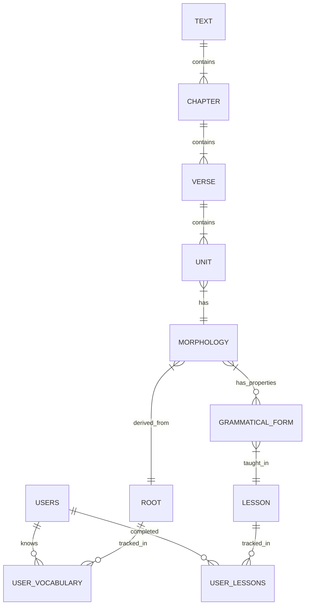

# Technical Design Document

## Overview
The **Azure-to-Supabase Migration** transforms the Greek Learning App from a distributed microservices architecture (Azure Functions, SQL, CosmosDB) into a unified, serverless application on Supabase. This project aims to eliminate infrastructure costs (targeting Supabase Free Tier) and simplify the developer experience for a fresh deployment.

**Users**: Developers (simplified maintenance), End Users (seamless learning experience).
**Impact**: Consolidates data storage, authentication, and business logic into a single platform, removing the need for Azure management.

### Goals
- Deploy a unified PostgreSQL schema replacing Azure SQL and CosmosDB.
- Implement Supabase Auth for user management.
- Reimplement "Adaptive Interlinear" logic using performant PostgreSQL functions (RPC).
- Replace Azure Functions with Supabase Edge Functions or RPCs.
- Refactor Frontend to use `supabase-js`.

### Non-Goals
- Migrating existing user data (system starts fresh).
- Multi-tenant architecture (single app instance).

## Architecture

### High-Level Architecture

```mermaid
graph TB
    subgraph "Frontend (Next.js)"
        App[Web App]
        AuthSDK[Supabase Auth SDK]
        DataSDK[Supabase Data Client]
    end

    subgraph "Supabase Platform"
        Auth[GoTrue (Auth)]
        Pg[PostgreSQL Database]
        Edge[Edge Functions (Deno)]
        
        subgraph "Database Logic"
            Tables[Relational Tables]
            RPC[RPC: render_chapter]
            RLS[Row Level Security]
        end
    end

    App --> AuthSDK
    App --> DataSDK
    AuthSDK --> Auth
    DataSDK --> Pg
    DataSDK --> Edge
    DataSDK --> RPC
```

### Technology Stack & Design Decisions

**1. Database Strategy: Relational Consolidation**
- **Decision**: Merge TextService (SQL) and UserService (NoSQL) into a single PostgreSQL schema.
- **Context**: Previously, text data was relational (SQL) and user progress was document-based (CosmosDB).
- **Selected Approach**:
    - **Text Data**: Direct mapping of existing tables (`Text`, `Chapter`, `Unit`, etc.).
    - **User Progress**: Normalized relational tables (`user_vocabulary`, `user_lessons`) instead of JSON arrays.
    - **User Settings**: `JSONB` column for flexible preferences.
- **Rationale**: Normalizing user progress enables high-performance SQL joins for the "Adaptive Interlinear" logic, avoiding the need to fetch and parse large JSON blobs for every page load.

**2. Logic Migration: Database-Centric (RPC)**
- **Decision**: Implement the core "Adaptive Interlinear" logic as a PostgreSQL RPC function (`render_chapter`).
- **Context**: The logic currently resides in a Go handler (`ReaderService`) that fetches all data and iterates in memory.
- **Selected Approach**: A PL/pgSQL function that joins `Unit` → `Morphology` → `GrammaticalForm` and checks against `user_vocabulary` and `user_lessons` tables to return the final text state ('recognized', 'needs help', 'unrecognized') in a single query.
- **Rationale**: drastically reduces latency and data transfer by performing complex filtering at the data source.

**3. Authentication: Supabase Auth**
- **Decision**: Replace Clerk/Azure Auth with Supabase Auth.
- **Rationale**: Native integration with PostgreSQL Row Level Security (RLS) allows us to secure data access declaratively at the database level.

## Components and Interfaces

### Database Layer (PostgreSQL)

#### Domain: Text & Grammar
**Responsibility**: Stores static Greek text, parsing data, and curriculum structure.
**Tables**:
- `texts`, `chapters`, `verses`
- `units`, `morphologies`, `roots`
- `grammatical_forms`, `lessons`
- `translations`

#### Domain: User Management
**Responsibility**: Stores user profiles, progress, and settings.
**Tables**:
- `public.users` (Links to `auth.users`)
- `user_settings` (JSONB)
- `user_vocabulary` (Join: `user_id`, `root_id`)
- `user_lessons` (Join: `user_id`, `lesson_id`)
- `sets`, `set_membership` (User-created flashcard sets)

**Row Level Security (RLS)**:
- **Public Data**: `SELECT` allowed for all authenticated/anon users on Text/Grammar tables.
- **User Data**: `ALL` allowed only where `auth.uid() == user_id`.

### Business Logic Layer (RPC & Edge Functions)

#### RPC: `render_chapter`
**Responsibility**: Generates the adaptive text view for a specific chapter and user.
**Mode**: `STABLE` (Read-only), accessible via `GET`.
**Interface**:
```sql
-- Accessible via: GET /rpc/render_chapter?p_chapter_id=123
FUNCTION render_chapter(
  p_chapter_id INT
) RETURNS TABLE (
  unit_id INT,
  content TEXT,
  help_text TEXT,
  status TEXT -- 'recognized', 'needs_help', 'unrecognized'
);
```
**Logic Flow**:
1. Select all units for the chapter.
2. Join morphology and grammatical forms.
3. **Check Vocabulary**: Is the `root_id` present in `user_vocabulary`?
4. **Check Grammar**: Are all grammatical properties (case, tense, etc.) linked to completed lessons in `user_lessons`?
5. **Determine Status**:
    - If Root unknown → 'unrecognized' (Return Translation)
    - If Grammar unknown → 'needs_help' (Return Greek + Helpers)
    - Else → 'recognized' (Return Greek)

#### Edge Function: `user-progress` (RESTful Endpoint)
**Responsibility**: Updates user progress (completing a lesson or set) and handles side effects (streaks, badges).
**Interface**: PATCH `/functions/v1/user-progress`
**Payload**:
```json
{
  "completed_lessons": [1, 2],
  "learned_words": [101, 102]
}
```
**Implementation Pattern (Deno)**:
```typescript
// supabase/functions/user-progress/index.ts
import { serve } from "https://deno.land/std@0.168.0/http/server.ts"
import { createClient } from "https://esm.sh/@supabase/supabase-js@2"

serve(async (req) => {
  const { completed_lessons, learned_words } = await req.json()
  
  // Create Supabase client with Auth Context
  const supabaseClient = createClient(
    Deno.env.get('SUPABASE_URL') ?? '',
    Deno.env.get('SUPABASE_ANON_KEY') ?? '',
    { global: { headers: { Authorization: req.headers.get('Authorization')! } } }
  )

  // Use RPC or Multi-statement transaction if supported, or chained calls
  // Ideally use a Postgres function for atomicity
  const { error } = await supabaseClient.rpc('update_user_progress', {
    p_lesson_ids: completed_lessons,
    p_word_ids: learned_words
  })

  if (error) return new Response(JSON.stringify({ error }), { status: 400 })
  
  return new Response(JSON.stringify({ success: true }), { headers: { "Content-Type": "application/json" } })
})
```

**Database Function for Update (`update_user_progress`)**:
```sql
CREATE OR REPLACE FUNCTION update_user_progress(
  p_lesson_ids INT[], 
  p_word_ids INT[]
) RETURNS VOID LANGUAGE plpgsql SECURITY DEFINER AS $$
DECLARE
  current_user_id UUID := auth.uid();
BEGIN
  -- Insert Lessons
  IF p_lesson_ids IS NOT NULL THEN
    INSERT INTO user_lessons (user_id, lesson_id)
    SELECT current_user_id, UNNEST(p_lesson_ids)
    ON CONFLICT DO NOTHING;
  END IF;

  -- Insert Vocabulary
  IF p_word_ids IS NOT NULL THEN
    INSERT INTO user_vocabulary (user_id, root_id)
    SELECT current_user_id, UNNEST(p_word_ids)
    ON CONFLICT DO NOTHING;
  END IF;
END;
$$;
```

### Frontend Integration
**Responsibility**: Client-side application state and rendering.

**Data Client Pattern**:
```typescript
// src/services/supabase-client.ts
import { createClient } from '@supabase/supabase-js'

const supabaseUrl = process.env.NEXT_PUBLIC_SUPABASE_URL!
const supabaseAnonKey = process.env.NEXT_PUBLIC_SUPABASE_ANON_KEY!

export const supabase = createClient(supabaseUrl, supabaseAnonKey)

export interface TextUnit {
  unit_id: number;
  content: string;
  help_text: string | null;
  status: 'recognized' | 'needs_help' | 'unrecognized';
  verse_number: number;
}

export async function fetchChapter(chapterId: number): Promise<TextUnit[]> {
  const { data, error } = await supabase
    .rpc('render_chapter', { p_chapter_id: chapterId })
  
  if (error) throw error;
  return data as TextUnit[];
}
```

## Data Models

### Physical Data Model (PostgreSQL)



**Table Definitions (Key Patterns)**:
```sql
-- User Vocabulary
CREATE TABLE user_vocabulary (
  user_id UUID REFERENCES auth.users NOT NULL,
  root_id INT REFERENCES roots(id) NOT NULL,
  created_at TIMESTAMPTZ DEFAULT NOW(),
  PRIMARY KEY (user_id, root_id)
);

-- User Settings (JSONB)
CREATE TABLE user_settings (
  user_id UUID REFERENCES auth.users PRIMARY KEY,
  preferences JSONB DEFAULT '{}'::JSONB,
  updated_at TIMESTAMPTZ DEFAULT NOW()
);
-- Example JSON: { "theme": "dark", "font_size": 16 }
```

## Migration Strategy

**Phase 1: Schema Setup**
1. Initialize Supabase project.
2. Run SQL migration scripts to create Text/Grammar tables (ported from `setupDatabase.sql`).
3. Run SQL scripts to create User tables (`public.users`, `user_vocabulary`, etc.).
4. Import static data (Greek texts, parsing info) from CSV/SQL dumps.

**Phase 2: Auth & RLS**
1. Configure Supabase Auth.
2. Create Trigger: `on_auth_user_created` → Insert into `public.users`.
3. Enable RLS on all tables.
4. Write Policies: Public Read for texts, Private CRUD for user data.

**Phase 3: Logic Implementation**
1. Implement `render_chapter` PL/pgSQL function.
2. Verify logic against existing Go implementation.

**Phase 4: Frontend Refactor**
1. Install `@supabase/supabase-js`.
2. Create `utils/supabase.ts` client.
3. Replace `ReaderService` calls with `rpc('render_chapter')`.
4. Replace `UserService` calls with direct table queries.
5. Remove Clerk and Azure dependencies.

## Correctness Properties

*A property is a characteristic or behavior that should hold true across all valid executions of a system—essentially, a formal statement about what the system should do. Properties serve as the bridge between human-readable specifications and machine-verifiable correctness guarantees.*

### Property 1: Row Level Security Isolation
*For any* two distinct authenticated users (User A and User B), when User A attempts to query User B's private data (user_vocabulary, user_lessons, user_settings, sets), the query should return zero results or raise an authorization error.
**Validates: Requirements 1.4**

### Property 2: Public Text Data Accessibility
*For any* authenticated or anonymous user, querying public text data (texts, chapters, verses, units, morphologies, roots, grammatical_forms, lessons, translations) should succeed and return the requested data.
**Validates: Requirements 1.4**

### Property 3: User Signup Completeness
*For any* valid user credentials, when a user signs up through Supabase Auth, both an auth.users entry and a corresponding public.users entry should be created with matching user IDs.
**Validates: Requirements 2.1, 2.2**

### Property 4: Unauthenticated Access Denial
*For any* protected route or private data resource, when accessed without valid authentication credentials, the system should deny access with an appropriate error response.
**Validates: Requirements 2.4**

### Property 5: Adaptive Interlinear Correctness
*For any* user progress state (set of known roots and completed lessons) and any chapter, the render_chapter function should correctly classify each word as:
- 'recognized' if the root is in user_vocabulary AND all grammatical properties are covered by user_lessons
- 'needs_help' if the root is in user_vocabulary BUT some grammatical properties are not covered
- 'unrecognized' if the root is not in user_vocabulary
**Validates: Requirements 3.5**

### Property 6: Migration Functional Equivalence
*For any* valid input that was supported by the legacy Azure services (TextService, UserService, StudyService, ReaderService), the new Supabase implementation should produce functionally equivalent output (same data structure and values, accounting for schema transformations).
**Validates: Requirements 3.3, 3.4**

### Property 7: Response Structure Conformance
*For any* data fetch operation for Reader or Vocab features, the response structure should conform to the defined TypeScript interfaces/types, with all required fields present and correctly typed.
**Validates: Requirements 4.4**

## Error Handling

### Database Errors
- **Connection Failures**: Frontend should gracefully handle Supabase connection errors with user-friendly messages and retry logic.
- **RLS Violations**: When RLS denies access, return 403 Forbidden with clear error messages (avoid leaking information about data existence).
- **Constraint Violations**: Foreign key and unique constraint violations should be caught and translated to meaningful user feedback.

### Authentication Errors
- **Session Expiry**: Implement automatic token refresh using Supabase Auth SDK; redirect to login on refresh failure.
- **Invalid Credentials**: Return clear error messages for signup/login failures without revealing whether email exists.
- **Rate Limiting**: Respect Supabase Auth rate limits; implement client-side throttling for repeated auth attempts.

### RPC/Edge Function Errors
- **Invalid Parameters**: Validate input parameters and return 400 Bad Request with specific validation errors.
- **Timeout Handling**: Set reasonable timeouts for RPC calls; implement fallback behavior for slow queries.
- **Transaction Failures**: Ensure atomic operations in Edge Functions; rollback on partial failures.

### Frontend Error Boundaries
- **Component-Level**: Wrap major features (Reader, Vocab) in error boundaries to prevent full app crashes.
- **Network Errors**: Display offline indicators and queue mutations for retry when connection is restored.
- **Data Validation**: Validate API responses against expected schemas; log and handle malformed data gracefully.

## Testing Strategy

### Unit Tests
Unit tests verify specific examples, edge cases, and error conditions:

**Database Schema Tests**:
- Verify all required tables exist after migration scripts run (Requirements 1.1, 1.2)
- Verify UserSettings table uses JSONB column type (Requirements 1.3)
- Verify foreign key constraints are properly defined

**RPC Function Tests**:
- Test `render_chapter` with empty user progress (all words unrecognized)
- Test `render_chapter` with complete user progress (all words recognized)
- Test `render_chapter` with partial grammar knowledge (needs_help state)
- Test edge cases: non-existent chapter_id, null values

**Authentication Flow Tests**:
- Test successful signup creates both auth and public.users entries
- Test duplicate email signup is rejected
- Test invalid credentials are rejected
- Test session token refresh mechanism

**Frontend Integration Tests**:
- Verify Supabase client is initialized with correct environment variables (Requirements 4.1)
- Verify no network requests are made to Azure or Clerk endpoints (Requirements 4.3)
- Test error boundary behavior with simulated API failures

### Property-Based Tests
Property-based tests verify universal properties that hold across all inputs. Each test should run a minimum of 100 iterations with randomly generated inputs.

**Testing Framework**: We will use **fast-check** for TypeScript/JavaScript property-based testing, integrated with the existing test framework (likely Jest or Vitest based on the Next.js setup).

**Property Test Requirements**:
- Each property-based test MUST be tagged with a comment explicitly referencing the correctness property from this design document
- Tag format: `// Feature: azure-to-supabase-migration, Property {number}: {property_text}`
- Each correctness property MUST be implemented by a SINGLE property-based test
- Tests should generate realistic random data (valid user IDs, chapter IDs, vocabulary sets, etc.)

**Property Test Specifications**:

1. **RLS Isolation Test** (Property 1):
   - Generate: Random pairs of user IDs, random private table queries
   - Execute: User A attempts to query User B's private data
   - Verify: Query returns empty or authorization error

2. **Public Data Access Test** (Property 2):
   - Generate: Random user authentication states (authenticated, anonymous), random public table queries
   - Execute: Query public text data
   - Verify: Query succeeds and returns data

3. **Signup Completeness Test** (Property 3):
   - Generate: Random valid user credentials (email, password)
   - Execute: Sign up user through Supabase Auth
   - Verify: Both auth.users and public.users contain matching entries

4. **Unauthenticated Denial Test** (Property 4):
   - Generate: Random protected endpoints/resources
   - Execute: Access without authentication token
   - Verify: Access denied with appropriate error

5. **Adaptive Interlinear Test** (Property 5):
   - Generate: Random user progress (sets of root_ids and lesson_ids), random chapter_id
   - Execute: Call render_chapter RPC
   - Verify: Each word's status matches the classification rules (recognized/needs_help/unrecognized)

6. **Migration Equivalence Test** (Property 6):
   - Generate: Random valid inputs from legacy API contract
   - Execute: Call both legacy Azure service (if available) and new Supabase implementation
   - Verify: Outputs are functionally equivalent (accounting for schema differences)

7. **Response Structure Test** (Property 7):
   - Generate: Random valid queries for Reader and Vocab features
   - Execute: Fetch data from Supabase
   - Verify: Response matches TypeScript interface (all required fields present and correctly typed)

### Integration Tests
- **End-to-End User Flow**: Sign up → Complete lesson → Mark words as known → Load chapter → Verify adaptive rendering
- **Cross-Feature Integration**: Verify vocabulary learning in one feature affects Reader display
- **Performance Benchmarks**: Measure `render_chapter` query time with various user progress sizes

### Security Testing
- **RLS Policy Verification**: Automated tests for all RLS policies using different user contexts
- **SQL Injection Prevention**: Test RPC functions with malicious input strings
- **Authentication Bypass Attempts**: Test direct database access without valid tokens

### Migration Validation
- **Data Integrity**: Compare row counts and key data samples between Azure SQL exports and Supabase imports
- **Schema Parity**: Verify all columns and relationships from legacy schema are represented in new schema
- **Functional Regression**: Run comprehensive test suite against both old and new systems to verify equivalence